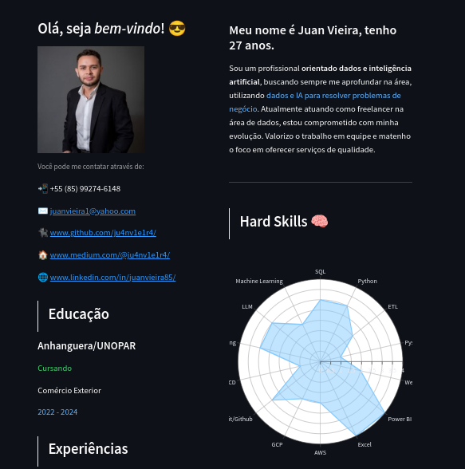
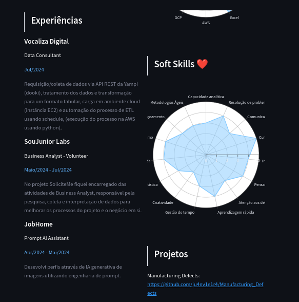
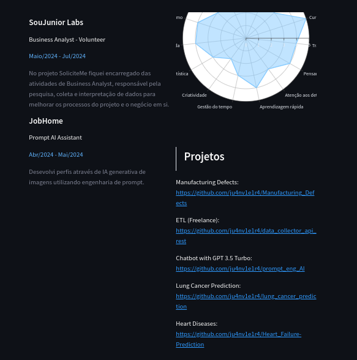

# Currículo Interativo com Streamlit

Este projeto é um aplicativo web interativo criado usando Streamlit para apresentar meu currículo e demonstrar minhas habilidades em Python, visualização de dados e desenvolvimento de aplicativos web. 

## Bibliotecas Utilizadas

- `streamlit`: Para criar a interface web.
- `matplotlib`: Para criar gráficos.
- `seaborn`: Para criar visualizações estatísticas.
- `plotly`: Para criar gráficos interativos.
- `pandas`: Para manipulação e análise de dados.
- `numpy`: Para operações numéricas.

## Estrutura do Projeto

O projeto consiste nos seguintes arquivos:

- `app.py`: O arquivo principal que contém o código do aplicativo Streamlit.
- `config.py`: Arquivo de configuração (detalhes específicos podem variar).
- `requirements.txt`: Lista de todas as dependências necessárias para executar o aplicativo.
- `Dockerfile`: Arquivo para construir uma imagem Docker do aplicativo. (Em andamento)

## Como Executar o Projeto

### Pré-requisitos

- Python 3.6 ou superior
- pip (Python package installer)
- Docker (opcional, para execução em contêiner)

